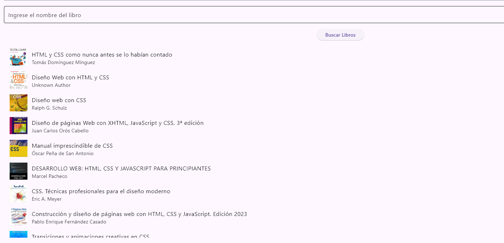

# Proyecto: Aplicación de Búsqueda de Pokémon y Libros

Este proyecto consiste en crear una aplicación que permita buscar y mostrar información sobre Pokémons, incluyendo su foto y características. Además, se implementará la capacidad de buscar libros a través de la API de Google Books.

---

## Actividad 1: Búsqueda y Visualización de Pokémons

La primera parte de la aplicación se enfoca en mostrar un Pokémon, junto con sus características y foto. Para esto, se hace uso de la API de [PokeAPI](https://pokeapi.co/). En el ejemplo dado, el Pokémon utilizado es "Ditto".

### Pasos

1. Realizar una solicitud HTTP al siguiente endpoint: `https://pokeapi.co/api/v2/pokemon/pikachu`.
2. Procesar la respuesta JSON para mostrar las siguientes características:
   - Nombre del Pokémon
   - Imagen del Pokémon
   - Tipo(s) del Pokémon
   - Habilidades
   - Estadísticas

**Ejemplo de respuesta:**

```json
  {
    "name": "ditto",
    "types": [
      {
        "type": {
          "name": "normal"
        }
      }
    ],
    "sprites": {
      "front_default": "https://raw.githubusercontent.com/PokeAPI/sprites/master/sprites/pokemon/132.png"
    },
    "abilities": [
      {
        "ability": {
          "name": "limber"
        }
      }
    ],
    "stats": [
      {
        "stat": {
          "name": "hp"
        },
        "base_stat": 48
      }
    ]
  }
```

**Imagen Ejemplo - Pokémon "Ditto"**:


## Actividad 2: Búsqueda de Libros

En esta actividad, se integrará la API de Google Books para buscar libros por nombre o título. La aplicación permitirá al usuario introducir un término de búsqueda y, en respuesta, mostrará una lista de libros con los siguientes detalles:

- título
- autor
- imagen de la portada

La API de Google Books se puede consultar mediante la URL: `https://www.googleapis.com/books/v1/volumes?q=search+terms`

### Pasos

**Ejemplo de consulta**:

Si se busca el término "JavaScript", la solicitud sería: `https://www.googleapis.com/books/v1/volumes?q=css`

**Imagen Ejemplo - Resultado de Búsqueda de Libro**:


